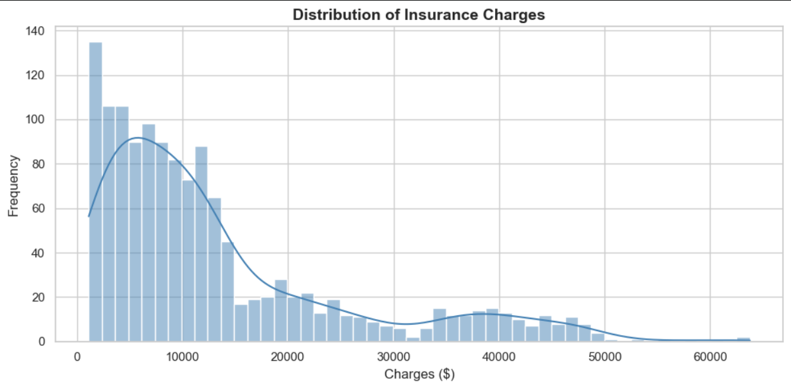
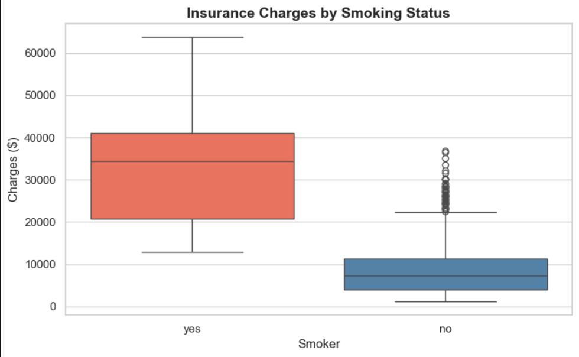
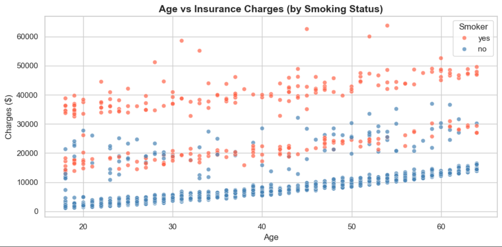
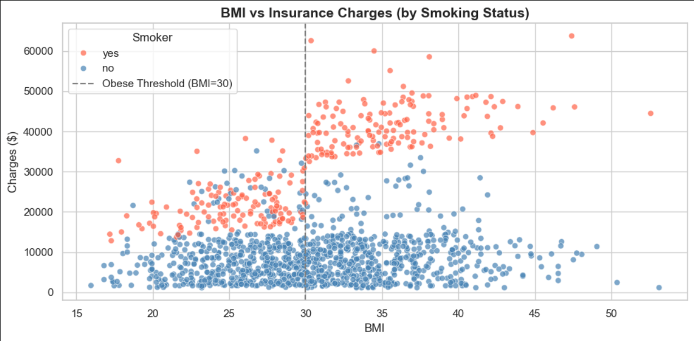
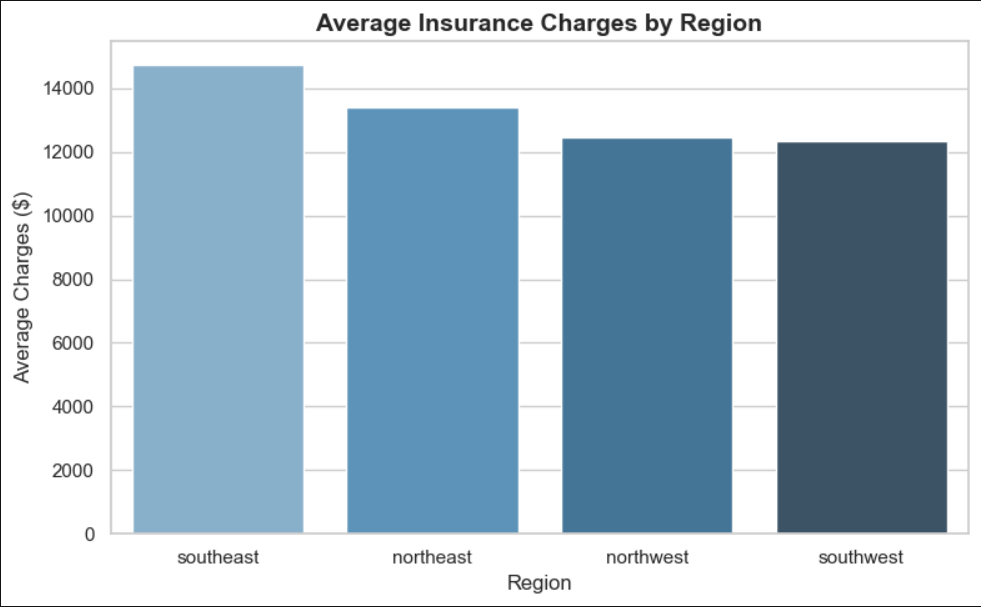
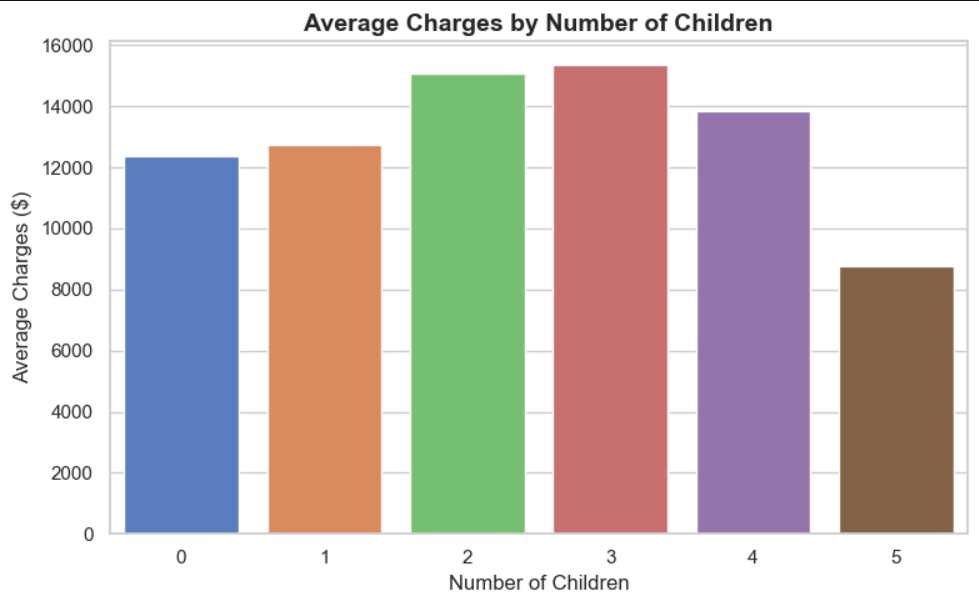
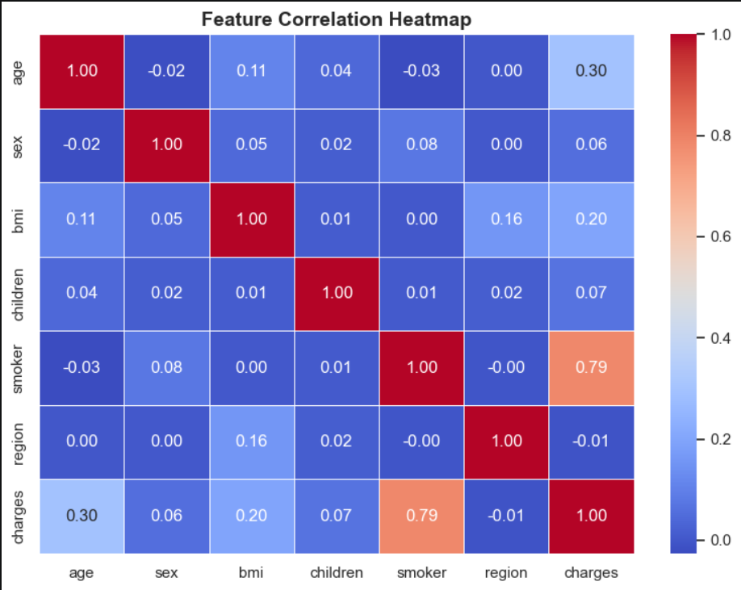
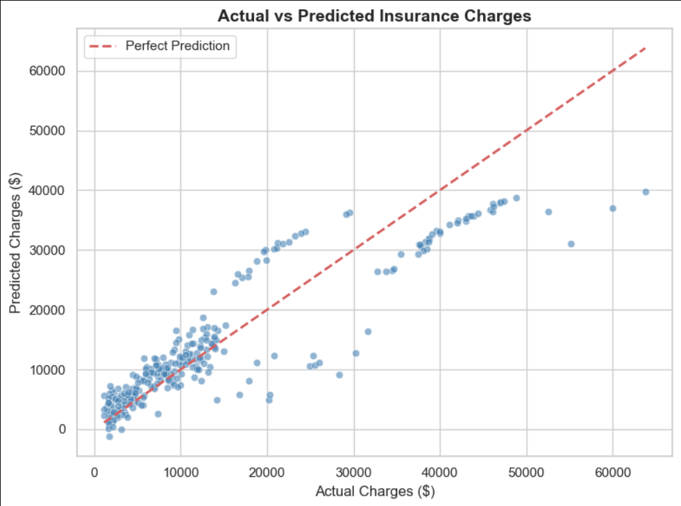
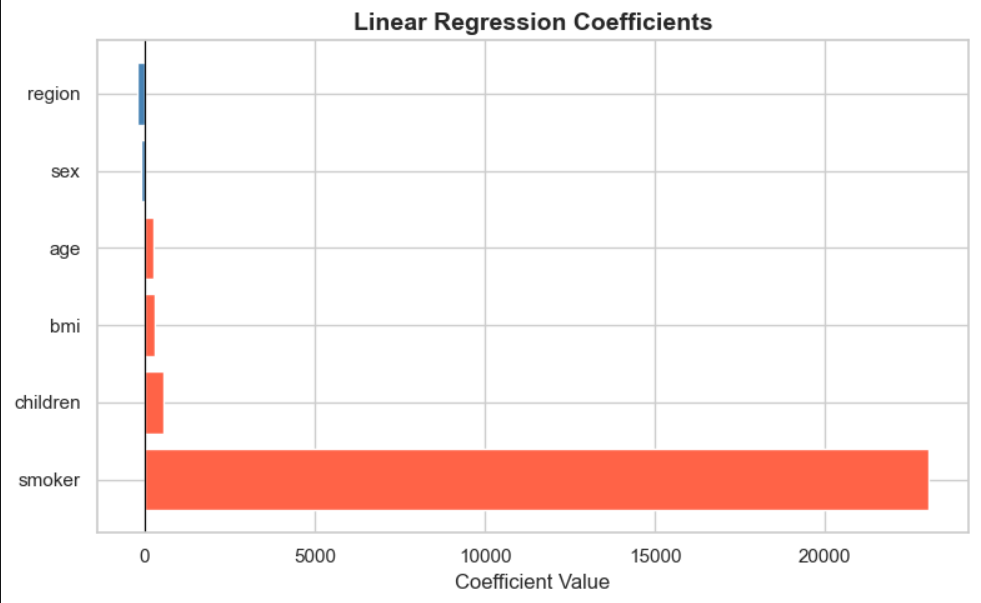
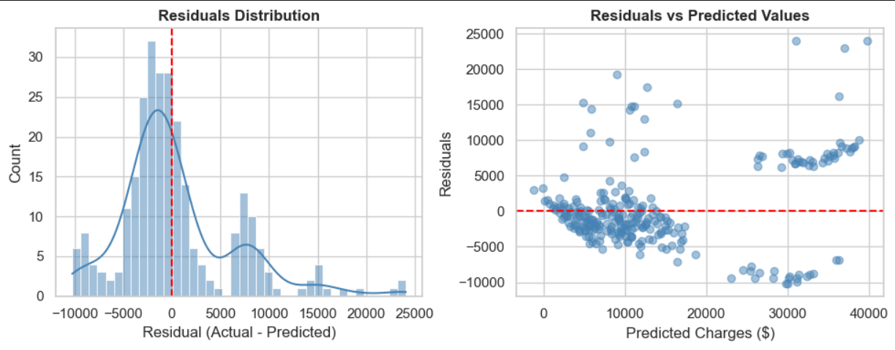

# Insurance Claim Prediction

Insurance companies need to price their policies correctly. Charge too little and claims eat into profits. Charge too much and customers leave. The only way to get pricing right is to understand what actually drives medical costs for each individual. This project builds a regression model to predict insurance charges based on personal attributes, and identifies which factors matter most.

---

## The Problem

Medical insurance charges in this dataset range from under $1,000 to over $60,000 for the same age groups. That kind of spread does not happen randomly. There are patterns behind it and finding them is what makes accurate pricing possible.

The distribution has a heavy right skew. Most customers fall in the lower charge range but a smaller group sits in a completely different bracket. The model needed to explain what separates those two populations.

---

## The Data

**Source:** Medical Cost Personal Dataset by Miri Choi, Kaggle
**Size:** 1,338 records, 7 features
**Target variable:** charges. Medical insurance cost billed to the individual.

Features included age, sex, BMI, number of children, smoking status, and residential region in the US.

---

## What I Did

**1. Cleaned the data**
Checked for missing values and duplicates. Applied label encoding to categorical columns: sex, smoker, and region.

**2. Explored the data**
The charts made the story clear before any model was trained.

Smokers pay dramatically more than non-smokers. The median charge for a smoker is around $35,000. The median for a non-smoker is around $7,500. That is nearly a 5x difference at the midpoint alone.

Age increases charges steadily for non-smokers. For smokers the effect compounds. Older smokers consistently sit at the top of the charge range across every age group in the dataset.

BMI on its own does not dramatically raise costs unless the person also smokes. The BMI vs charges chart splits cleanly into two bands at the obesity threshold of 30. Non-smokers stay flat regardless of BMI. Smokers above BMI 30 jump to a much higher charge range. This interaction between BMI and smoking is the key dynamic the model struggles to fully capture with standard linear regression.

Region had a small but visible effect. Southeast customers were billed the most on average, southwest the least.

Number of children showed no clear linear pattern. Charges peaked at 2 to 3 children and dropped for larger families, likely due to sample size effects at the higher counts.

The correlation heatmap confirmed smoking status as the dominant predictor at 0.79 correlation with charges. Age came second at 0.30 and BMI third at 0.20. Sex, children, and region contributed very little individually.

**3. Trained the model**
I trained a Linear Regression model using an 80/20 train-test split with a fixed random state for reproducibility.

**4. Evaluated the model**
The model was assessed using MAE, RMSE, and R² on the test set, along with residual analysis to understand where predictions broke down.

---

## Results

| Metric | Value |
|---|---|
| MAE | $4,186 |
| RMSE | $6,047 |
| R² | 0.7515 |

The model explains 75% of the variance in insurance charges. The actual vs predicted chart shows the model performs well across most of the range but undershoots on the highest charge cases, exactly the obese smoker segment identified in EDA.

The regression coefficients make the dominance of smoking status impossible to ignore. Its coefficient is over 22,000, meaning the model adds more than $22,000 to the predicted charge simply for being a smoker, holding everything else constant. Every other feature is nearly invisible by comparison.

The residuals plot confirms the model's weakness at the high end. Errors grow larger as predicted charges increase, which is a sign that the interaction between BMI and smoking is not being captured. A model with an explicit BMI x smoker interaction term would likely close this gap.

---

## What the Model Tells the Insurer

Smoking status alone accounts for more predictive power than all other features combined. An insurer using this model should treat any missing or unverified smoking status as the highest priority data quality issue. Getting that one variable wrong will produce larger pricing errors than inaccuracies in any other field.

The combination of smoker and BMI over 30 is where the model underpredicts most. These are the highest risk individuals in the dataset and they are also the ones the current model prices least accurately. Adding an interaction feature between smoking and obesity would directly address this gap.

---

## Tech Stack

Python, pandas, NumPy, scikit-learn, matplotlib, seaborn

---

## Author

**Aiman Ishaq**
CS Student | Data Analyst Intern, Developers Hub Corporation
[LinkedIn](https://linkedin.com/in/aiman-ishaq) . [GitHub](https://github.com/aiman-ami)
